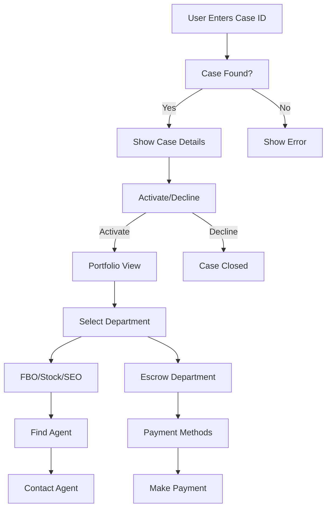

# casemngt
case management software
# Case Management System

A comprehensive PHP-based case management system designed for financial recovery and investigation services. This system provides both user and admin interfaces with complete case tracking, KYC management, agent coordination, and secure payment processing.

## 🚀 Quick Start

1. **Upload Files**: Upload all files to your cPanel hosting
2. **Create Database**: Set up MySQL database using `database_setup.sql`
3. **Configure**: Update database credentials in `config.php`
4. **Access**: Visit your domain and start using the system

**Default Admin Login:**
- URL: `/admin_login.php`
- Username: `admin`
- Password: `admin123` ⚠️ **Change immediately!**

## ✨ Features

### 👤 User Interface
- **Case Search**: Find cases by unique ID
- **Case Activation**: Activate or decline cases
- **Portfolio View**: Complete case details with KYC status
- **Department Selection**: Choose from FBO, Stock Exchange, SEO, or Escrow
- **Agent Contact**: Connect with specialized agents
- **Payment Methods**: Secure escrow payment options

### 🛡️ Admin Interface
- **Dashboard**: Statistics and overview
- **Case Management**: Create, edit, and manage cases
- **KYC Control**: Approve/reject verification documents
- **Agent Management**: Add and manage department agents
- **Payment Setup**: Configure payment methods
- **Activity Logging**: Track all system activities

### 🔐 Security Features
- Password hashing with bcrypt
- SQL injection protection
- XSS prevention
- Session management
- Access logging
- Input sanitization
- CSRF protection

## 📋 System Requirements

- **PHP**: 7.4+ with PDO extension
- **MySQL**: 5.7+ or MariaDB 10.2+
- **Web Server**: Apache with mod_rewrite
- **Storage**: 100MB minimum
- **Memory**: 128MB PHP memory limit

## 📁 File Structure

```
📦 Case Management System
├── 📄 config.php                 # Database configuration
├── 📄 index.php                  # Main landing page
├── 📄 case_details.php           # Case details and activation
├── 📄 portfolio.php              # Portfolio dashboard
├── 📄 office_selection.php       # Department selection
├── 📄 find_agent.php             # Agent finder
├── 📄 payment_methods.php        # Payment options
├── 📄 admin_login.php            # Admin authentication
├── 📄 admin_dashboard.php        # Admin control panel
├── 📄 admin_logout.php           # Admin logout
├── 📄 database_setup.sql         # Database structure
├── 📄 .htaccess                  # Security configuration
├── 📄 README.md                  # This file
└── 📄 INSTALLATION_GUIDE.md      # Detailed setup guide
```

## 🔧 Installation

### Quick Setup (5 minutes)

1. **Download & Upload**
   ```bash
   # Upload all files to your web directory
   ```

2. **Database Setup**
   ```sql
   -- Run database_setup.sql in phpMyAdmin
   ```

3. **Configure Database**
   ```php
   // Edit config.php
   $dbname = 'your_database_name';
   $username = 'your_db_username';
   $password = 'your_db_password';
   ```

4. **Test Installation**
   - Visit your website
   - Try case ID: `CASE001` (sample data)
   - Login to admin: `/admin_login.php`

### Detailed Installation
See [INSTALLATION_GUIDE.md](INSTALLATION_GUIDE.md) for complete setup instructions.

## 🎯 Usage

### For End Users
1. **Search Case**: Enter your case ID on the homepage
2. **Activate Case**: Choose to activate or decline your case
3. **View Portfolio**: See all case details and KYC status
4. **Select Department**: Choose appropriate office for your case
5. **Contact Agent**: Get in touch with specialized agents
6. **Payment Options**: Use secure escrow payment methods

### For Administrators
1. **Login**: Access admin panel with secure credentials
2. **Dashboard**: Monitor system statistics and activity
3. **Manage Cases**: Create, edit, and track all cases
4. **KYC Management**: Approve or reject verification documents
5. **Agent Control**: Add agents and manage departments
6. **System Monitoring**: View activity logs and usage statistics

## 🛡️ Security Best Practices

### Immediate Actions (Required)
- [ ] Change default admin password
- [ ] Update database credentials
- [ ] Enable SSL certificate
- [ ] Set proper file permissions

### Ongoing Security
- [ ] Regular backups
- [ ] Monitor access logs
- [ ] Update PHP/MySQL regularly
- [ ] Use strong passwords
- [ ] Implement IP restrictions for admin access

## 📊 Database Schema

### Core Tables
- **cases**: Main case information and status
- **admins**: Administrator accounts
- **agents**: Department agents and contact info
- **payment_methods**: Available payment options
- **activity_logs**: System activity tracking

### Sample Data Included
- 3 test cases with different statuses
- 6 agents across all departments
- 7 payment methods
- 1 admin account (default)

## 🔄 Workflow



## 🎨 Customization

### Styling
- CSS is embedded in each file for easy customization
- Uses modern gradient backgrounds and animations
- Responsive design for mobile devices
- Font Awesome icons included

### Functionality
- Easily add new case types
- Expandable department system
- Customizable payment methods
- Configurable KYC workflow

## 🚨 Troubleshooting

### Common Issues

**Database Connection Error**
```php
// Check config.php credentials
// Verify database exists
// Test connection manually
```

**Permission Denied**
```bash
# Set file permissions
chmod 644 *.php
chmod 755 directories
chmod 600 config.php
```

**Admin Login Failed**
```sql
-- Reset admin password in database
UPDATE admins SET password = '$2y$10$92IXUNpkjO0rOQ5byMi.Ye4oKoEa3Ro9llC/.og/at2.uheWG/igi' WHERE username = 'admin';
-- Password will be: admin123
```

**Missing Features**
- Check PHP version compatibility
- Verify all files uploaded correctly
- Ensure database setup completed

## 📈 Performance

### Optimization Tips
- Enable PHP OPcache
- Use CDN for static assets
- Implement database indexing
- Configure server-level caching

### Monitoring
- Track database query performance
- Monitor disk space usage
- Set up error logging
- Regular backup verification

## 🔮 Future Enhancements

### Planned Features
- Email notifications
- File upload for KYC documents
- Advanced reporting dashboard
- Multi-language support
- API integration
- Mobile app compatibility

### Scalability
- Database optimization for large datasets
- Caching layer implementation
- Load balancing support
- Microservices architecture

## 📝 License

This project is proprietary software created for specific business requirements. All rights reserved.

## 🤝 Support

For technical support or questions:

1. Check the [Installation Guide](INSTALLATION_GUIDE.md)
2. Review common troubleshooting steps
3. Contact your hosting provider for server issues
4. Check error logs for specific problems

## 🔄 Version History

### v1.0.0 (Current)
- Initial release
- Complete user and admin interfaces
- Full case management system
- KYC workflow implementation
- Department and agent management
- Secure payment processing
- Activity logging and monitoring

---

**🎉 Ready to deploy? Follow the [Installation Guide](INSTALLATION_GUIDE.md) for detailed setup instructions!**
